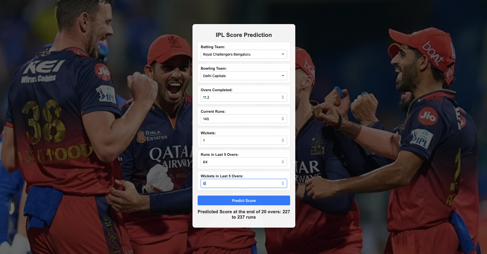

# 🏏 IPL Score Predictor

A machine learning web application for predicting IPL (Indian Premier League) match scores! 🚀

---

## 📂 Project Structure

```
IPL_SCORE_PREDICTOR/
├── static/
│   └── rcb.webp             # Team image/logo
├── templates/
│   └── index.html           # Frontend HTML page
├── .gitignore               # Git ignore file
├── application.py           # Flask app script
├── images.jpeg               # Another image resource
├── ipl_model.pkl             # Trained model file
├── ipl.csv                   # IPL dataset for training
├── LICENSE                   # License for this repo
└── score_predictor_IPL.ipynb # Notebook for model development
```

---

## ⚙️ Features

✅ IPL Score Prediction  
✅ Interactive Web Interface  
✅ Pre-trained ML Model  
✅ Minimal and intuitive design  

---

## 🚀 Quick Start

1. **Clone the repo**  
   ```
   git clone https://github.com/rohith05196/IPL_score_predictor.git
   cd IPL_SCORE_PREDICTOR
   ```

2. **Create a virtual environment**  
   ```
   python3 -m venv venv
   source venv/bin/activate
   ```

3. **Install dependencies**  

   - All the dependecies can be completely included in `requirements.txt`.
   - In this project all libraries are downloaded and installed on the go.
   ```
   pip install -r requirements.txt
   ```

4. **Run the Flask app**  
   ```
   python application.py
   ```

5. **Open the app**  
   Navigate to [http://127.0.0.1:port](http://127.0.0.1:port) and start predicting! 🎉

---

## 🧠 Model Info

- Model file: `ipl_model.pkl`
- Dataset: `ipl.csv` - `Kaggle Dataset for IPL 2008 - 2021`
- Model development and training details can be found in `score_predictor_IPL.ipynb`.

---

## ✨ How the webite looks
 - All you need to include
   - Batting Team
   - Bowling Team
   - Current score
   - Overs bowled
   - Wickets down 
   - Runs in last 5 overs (Just to see if scoring is accelerating)
   - Wickets in last 5 Overs.
   - The website will predict scores achivable at the end of 20 overs :) . 




## Future Scope

- Utilize Differet ML algorithm 
- Predition of cricket score is a general term, the factors that influence are many
**TODO:**
- More features for training
   - Vennue plays an important role
   - Toss is a factor as well
   - Team (for example recently a team with experienced players perform well in Impoertant matches like playoffs etc)
   - History / head to head records
   - form of players (recent) - like 100s scored, wickets taken etc etc

